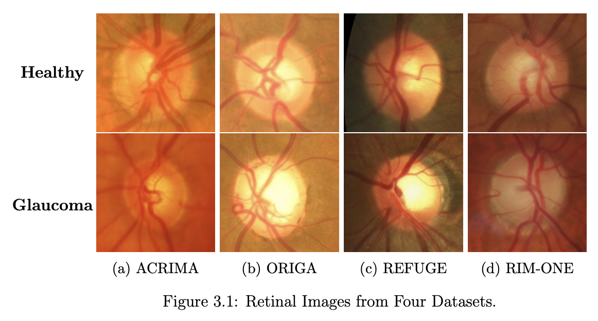
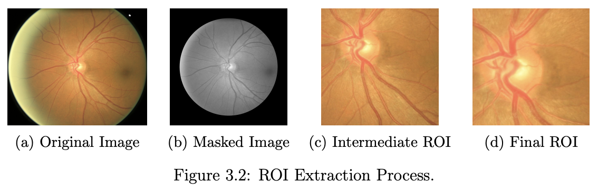
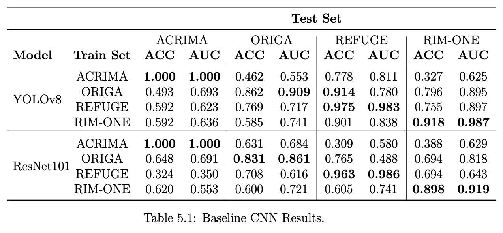
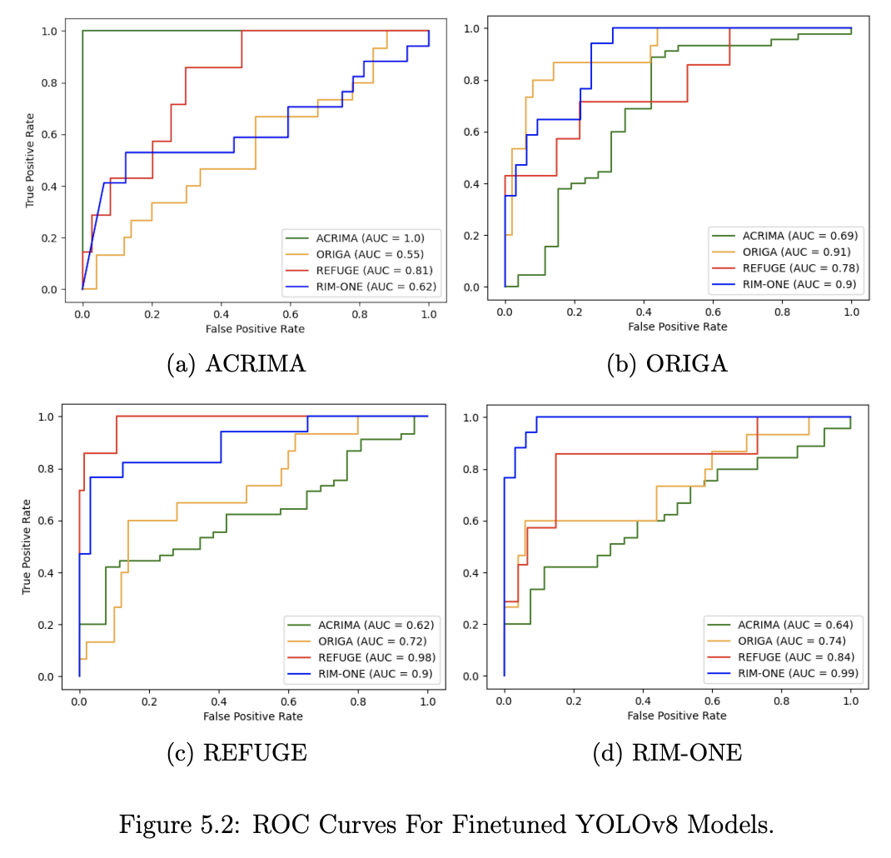
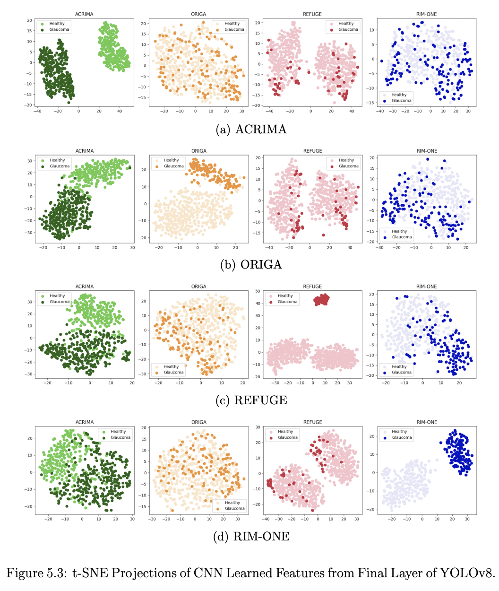
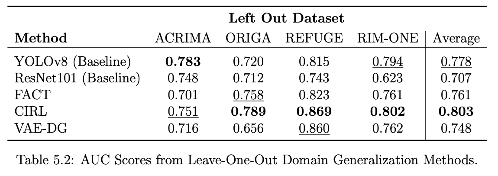
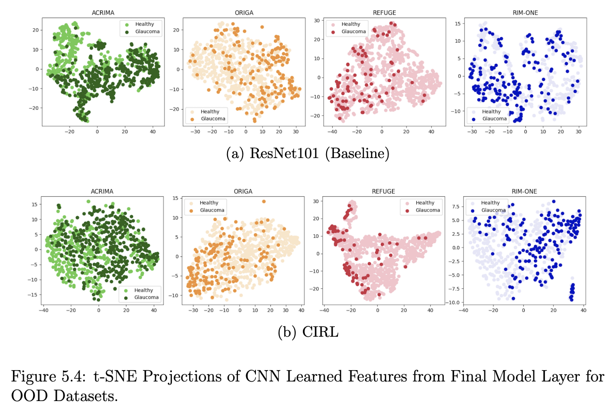

# Domain Generalization for Deep Learning-Based Glaucoma Classification
This repository contains the code and main results from my thesis: "Envisioning Automated Glaucoma Screening: Domain Generalization for Deep Learning-Based Glaucoma Classification." (Princeton University, 2024)

## Abstract 
In this thesis, we investigate the potential and challenges in applying deep learning models for medical image classification to large-scale disease screening programs. We analyze domain shift across four public retinal image datasets and investigate its effect on baseline glaucoma classification model performance. We find that domain shift severely degrades classification ability, and, specifically, image features extracted during model training do not generalize to out-of-domain images. We further test three state-of-the-art domain generalization methods and find that one method marginally improves model generalization, though not to an adequate level for clinical use.

## Data
We use four publicly available retinal image datasets annotated with glaucoma diagnosis.

1. ACRIMA Project (ACRIMA) ([Diaz-Pinto et al., 2009](https://doi.org/10.1186/s12938-019-0649-y))
2. Online Retinal fundus Image database for Glaucoma Analysis (ORIGA) ([Zhang et al., 2010](https://doi.org/10.1109/IEMBS.2010.5626137))
3. REtinal FUndus Glaucoma ChallengE (REFUGE) ([Orlando et al., 2020](https://doi.org/10.1016/j.media.2019.101570))
4. Retinal IMage database for Optic Nerve Evaluation for Deep Learning (RIMONE DL) ([Batista et al., 2020](https://doi.org/10.5566/ias.2346))

You may download the full datasets here:
- ORIGA and REFUGE: https://www.kaggle.com/datasets/arnavjain1/glaucoma-datasets
- ACRIMA: https://figshare.com/s/c2d31f850af14c5b5232
- RIM-ONE: https://github.com/miag-ull/rim-one-dl

### Data Directory Structure
 - `data/`
  - `ACRIMA/`  
    - `train/`
        - `0/` healthy
        - `1/` glaucoma
    - `val/`
        - `0/`
        - `1/`
    - `test/`
        - `0/`
        - `1/`
  - `ORIGA/`  
    - `train/`
        - `0/` healthy
        - `1/` glaucoma
    - `val/`
        - `0/`
        - `1/`
    - `test/`
        - `0/`
        - `1/`

## Results

### Region-of-Interest Extraction
Glaucoma diagnosis is based on the inspection of the optic cup-to-disc ratio in retinal images. We developed a two-round algorithm to crop the retinal images to the region of interest, the optic disc, to reduce image size and noise while preserving relevant information for glaucoma classification. The algorithm, based on the paper by [Zhang et al., 2010](https://doi.org/10.1109/ICIEA.2010.5515221), begins by converting the retinal image to grayscale and masking out the pixels on the outer border of the retina, which often has a bright fringe due to imaging conditions. Then, the image is divided into a square grid and cropped to the grid tile that contains the highest percentage of brightest pixels. This step is repeated twice to achieve a tight crop containing the correct ROI.  

### Classification Model Performance
We fine-tuned two popular convolutional neural networks, ResNet101 ([He at al., 2015](
https://doi.org/10.48550/arXiv.1512.03385)) and YOLOv8 ([Redmon et al., 2016](https://doi.org/10.48550/arXiv.1506.02640)), on the retinal image datasets to classify glaucoma. We trained both models on each dataset separately and evaluated the performance of each model on a held-out subset of images from the dataset it was trained on (in-domain) and images from the three remaining datasets not used in training (out-of-domain). We report the accuracy, AUC score, and ROC curves below for each model on each dataset. All models perform fairly well on their in-domain data, with YOLOv8 matching or outperforming ResNet101, but decline considerably on out-of-domain images. These results indicate that conventional neural networks fine-tuned for glaucoma classification fail to sufficiently generalize to retinal images from unseen domains, despite strong physical similarities between data sources.

### Feature Extraction
When a trained convolutional neural network makes a prediction on a new image, the image is fed through the convolutional layers to extract the relevant features learned by the model during training; then, a classifier predicts the class of the image based on these extracted features. To better understand how these features apply to in-domain versus out-of-domain retinal images, we extracted the feature embedding vectors from the final layers of the ResNet101 and YOLOv8 models. We used the dimensionality reduction method t-SNE [van der Maaten and Hinton, 2008](https://www.jmlr.org/papers/volume9/vandermaaten08a/vandermaaten08a.pdf) to visualize the embeddings vectors for each image on a two-dimensional plot. Each row shows the features learned by a model trained on a single dataset. Along the diagonal, which corresponds to the features extracted from the same dataset that the model was trained on (in-domain), there is almost complete separation between the two classes, demonstrating how the models successfully learned features that distinguish between 'healthy' and 'glaucoma' images. However, in the off-diagonal and out-of-domain plots, the classes either cluster loosely (i.e. REFUGE-trained, RIM-ONE prediction) or fail to cluster entirely (i.e. ACRIMA-trained, ORIGA prediction). The feature embedding extraction method is a useful tool for evaluating models based on their learned features, and the resulting plots help to explain the performance drop on out-of-domain images.

### Domain Generalization Method Performance
Unlike traditional deep learning models, which are built on the assumption that the inference data comes from the same underlying distribution as the training data, domain generalization methods aim to mitigate the detrimental effects of potential "domain shift". We fine-tuned three domain generalization methods, all built on top of the ResNet architecture, and compared their performance and learned features to the baseline models. All three methods attempt to identify and separate dataset-specific features from class-predictive features during training, using only the predictive features for classification. We find that CIRL has the highest out-of-domain performance on average, but the percent improvement compared to YOLOv8 is fairly small, indicating that these domain generalization methods do not adequately address the issue of domain shift in retinal images.

1. Fourier-based Augmented Co-teacher (FACT) ([Xu et al., 2021](https://doi.org/10.48550/arXiv.2105.11120))
2. Causality Inspired Representation Learning (CIRL) ([Lv et al., 2022](https://doi.org/10.48550/arXiv.2203.14237))
3. Variational Autoencoder for Domain Generalization (VAE-DG) ([Chokuwa and Khan, 2023](https://doi.org/10.48550/arXiv.2309.11301))

The ResNet101, YOLOv8, and CIRL model weights are available here: . For direct comparison with the domain generalization methods, each model was trained four times in leave-one-out style, with three datasets used for model training and the held-out dataset used to evaluate testing performance.

